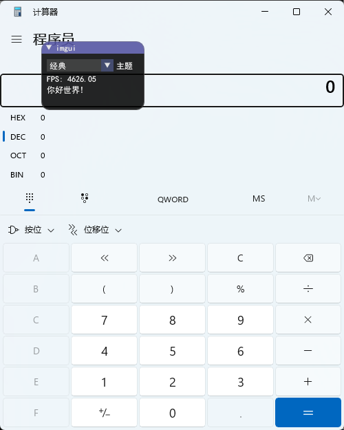
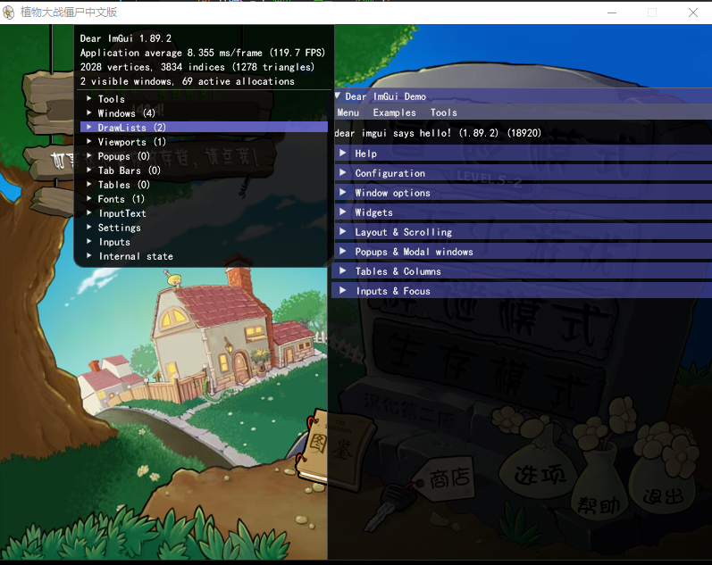

# imgui-rs-overlay
依赖[imgui-rs](https://github.com/imgui-rs/imgui-rs)与[windows-rs](https://github.com/microsoft/windows-rs)
## 平台
仅支持windows
# 版本
* [imgui-rs-0.12-DirectX11(👈当前)](https://github.com/lngex/imgui-rs-overlay/tree/master)
* [imgui-rs-0.12_vulkan-1.16](https://github.com/lngex/imgui-rs-overlay/tree/vulkan_1.14)

# 示例

Cargo.toml
```toml
imgui-rs-overlay={git = "https://github.com/lngex/imgui-rs-overlay"}
imgui = "0.12.0"
```
## EXE




main.rs
```rust
use imgui::Condition;
use std::borrow::Cow;
use imgui_rs_overlay::{Result, window::{Windows, WindowsOptions}};


fn main() -> Result<()> {
    let mut index = 2usize;
    let items = ["深色", "高亮", "经典"];
    let mut app = Windows::new(&WindowsOptions::default())?;
    app.run(move |ui, style| {
        ui.window("imgui")
            .resizable(false)
            .size([150.0, 100.0], Condition::FirstUseEver)
            .movable(true)
            .build(|| {
                if ui.combo("主题", &mut index, &items, |item| {
                    Cow::Owned(String::from(*item))
                }) {
                    match index {
                        0 => { style.use_dark_colors() }
                        1 => { style.use_light_colors() }
                        2 => { style.use_classic_colors() }
                        _ => { style }
                    };
                }
                ui.text(format!("FPS: {:.2}", ui.io().framerate));
                ui.text("你好世界!");
            });
        true
    })?;
    Ok(())
}
```
## DLL



lib.rs
```rust
use imgui_rs_overlay::window::{GetCurrentProcessId, WindowsOptions};
use imgui_rs_overlay::{key_down, OverlayTarget};
use std::os::raw::c_void;

#[no_mangle]
pub unsafe extern "stdcall" fn DllMain(hinst_dll: *mut c_void, fdw_reason: u32, _lpv_reserved: *mut c_void) -> i32 {
    match fdw_reason {
        1 => {
            let dll = hinst_dll as usize;
            std::thread::spawn(move || {
                let result = imgui_rs_overlay::window::Windows::new(&WindowsOptions {
                    title: "pva".to_string(),
                    overlay_target: OverlayTarget::WindowOfProcess(GetCurrentProcessId()), // 获取当前窗口
                    dll_hinstance:dll, // 模块句柄 释放时使用
                    ..WindowsOptions::default()
                });
                let mut windows = result.unwrap();
                let _ = windows.run(|ui, _style| {
                    ui.show_demo_window(&mut true);
                    !key_down!(35) // end退出后DLL也会自动卸载
                });
                true
            });
            1
        }
        _ => {
            1
        }
    }
}
```


