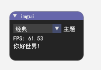

## 示例


Cargo.toml
```toml
imgui-rs-overlay={git = "https://github.com/lngex/imgui-rs-overlay",default-features = false,features = ["windows"],branch = "vulkan_1.14"}
anyhow = "1.0.89"
env_logger = "0.11.5"
log = "0.4.22"
```
main.rs
```rust
use std::borrow::Cow;

use imgui_rs_overlay::{app::window_app, OverlayOptions, OverlayTarget};
use imgui_rs_overlay::imgui::{Condition, Style, Ui};
use imgui_rs_overlay::winit::event_loop::EventLoopBuilder;

fn main() {
    env_logger::builder()
        .filter_level(log::LevelFilter::Trace)
        .parse_default_env()
        .init();
    let mut index = 2usize;
    let items = ["深色", "高亮", "经典"];
    let func = move |ui: &mut Ui, style: &mut Style| {
        ui.window("imgui")
            .resizable(false)
            .size([150.0, 100.0], Condition::FirstUseEver)
            .movable(true)
            .build(|| {
                if ui.combo("主题", &mut index, &items, |item| {
                    Cow::Owned(String::from(*item))
                }) {
                    match index {
                        0 => { style.use_dark_colors() }
                        1 => { style.use_light_colors() }
                        2 => { style.use_classic_colors() }
                        _ => { style }
                    };
                }
                ui.text(format!("FPS: {:.2}", ui.io().framerate));
                ui.text("你好世界!");
            });
        true
    };
    let mut options = OverlayOptions {
        target: OverlayTarget::WindowTitle(String::from("计算器")),
        fps: 60,
        ..OverlayOptions::default()
    };
    let event_loop = EventLoopBuilder::default().build().unwrap();
    let mut windows_app = window_app::WindowApp::new(func, &mut options);
    event_loop.run_app(&mut windows_app).unwrap();
}
```


